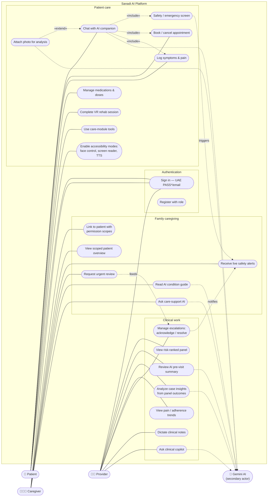
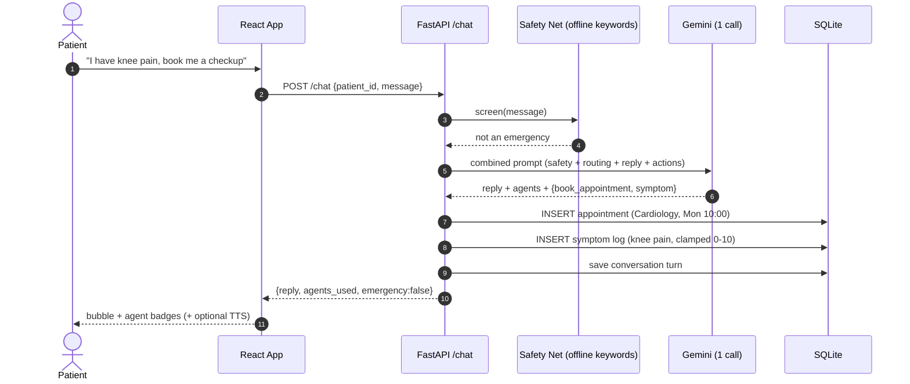
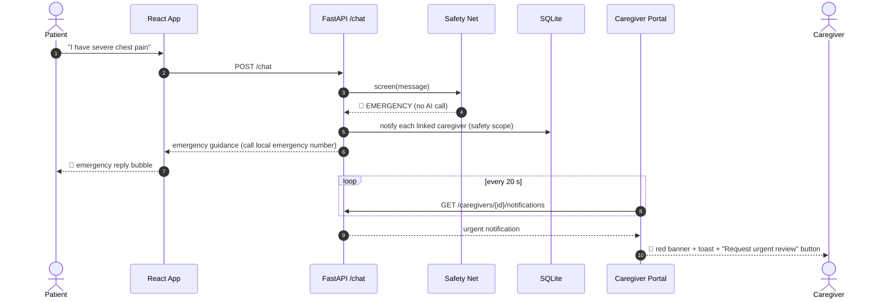
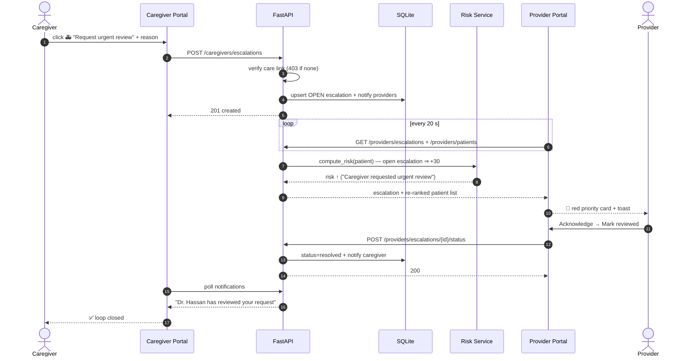
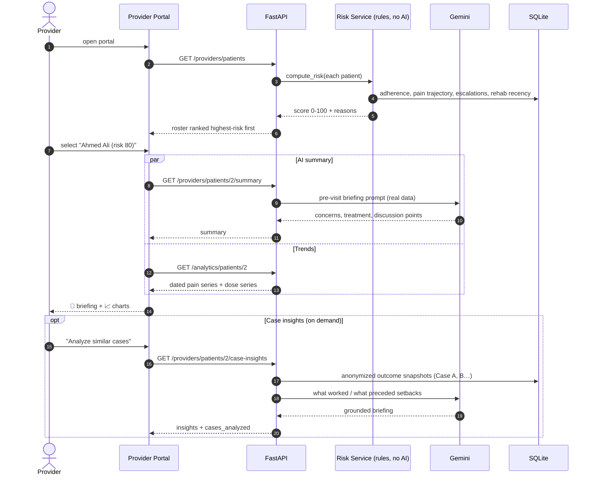

# Sanadi AI — UML Design Documentation

UML views of the system: the use case model and the sequence diagrams for the
four workflows that define the product. All diagrams are Mermaid — GitHub
renders them natively in this file.

---

## 1. Use case diagram

Three primary actors (Patient, Caregiver, Provider), one secondary actor
(Google Gemini). The Safety Screen is `«include»`-ed into every patient chat;
photo analysis `«extend»`s the chat.

\* UAE PASS is a simulated visual integration in the demo.

---

## 2. Sequence diagram — AI chat with real actions (single-call orchestration)

The signature flow: one message produces a reply **and** real database
side-effects, within one Gemini call (free-tier friendly).

---

## 3. Sequence diagram — emergency safety net → live caregiver alert

Zero AI calls on the critical path: the keyword net works even if Gemini is
down or rate-limited. The caregiver portal polls every 20 s.

---

## 4. Sequence diagram — connected-care escalation loop

One event travels through all three roles and closes the loop.

---

## 5. Sequence diagram — provider opens a patient (triage → AI briefing)

---

*Also documented in this repo:* [README](../README.md) — full feature list,
API reference, architecture layout, and deployment topology.
